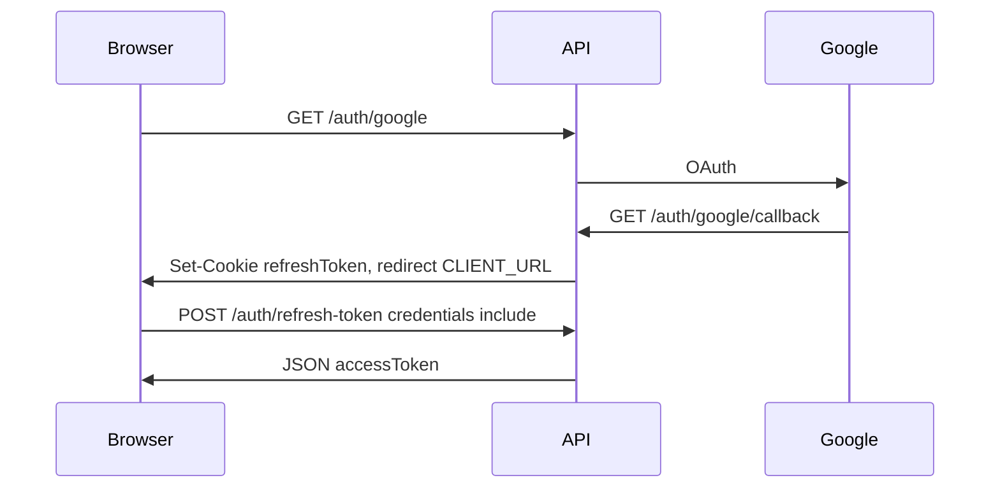

# Paytm backend API doc (for frontend)

**File coverage:** The first API-doc draft was from routes + controllers + Zod, not all 24 files. All 24 under [`backend/src`](backend/src) are now read. Extra frontend-facing facts from models/utils/mailer/cleanup are folded into this spec. There are **no extra HTTP routes** hiding in utils/models (only cron, email, hashes, TTL).

After you confirm, this spec will be written to [`backend/API.md`](backend/API.md).

Base URL: `http://localhost:3001` (or `PORT` from `.env`). CORS origin is **`http://localhost:5173`** with **`credentials: true`**. All JSON bodies are `Content-Type: application/json`.

**Two response shapes (important):**

- Success / most controller errors: `{ "message": "..." }` or a data object (no `error` wrapper).
- Zod, missing JWT, 404 catch-all, 500, **rate limit 429**: `{ "error": { "message": "...", "status": number } }`.

**Auth:**

- Access token: header `Authorization: Bearer <accessToken>` (JWT, **1 hour**, payload `id` + `email`).
- Refresh token: **HttpOnly cookie** `refreshToken` (7 days). Browser must send `credentials: "include"` on API calls that need the cookie (`/refresh-token`, `/logout`, Google return).
- Protected routes below are marked **JWT**.

**Password (string) wherever required:** min 8, max 100, at least one lowercase, one uppercase, one digit, one special (`[\W_]`). Login uses the **same** rule (weak passwords fail Zod before Passport).

**OTP:** string, exactly 6 digits `"0"-"9"`. Emails say it expires in **10 minutes** ([`otp.js`](backend/src/utils/otp.js)). **Username:** 3–30 chars, `[a-zA-Z0-9_]`. **Email:** valid email, stored lowercase.

**Verify within 24 hours:** daily 3 AM cron deletes unverified users older than 24 hours ([`cleanup.js`](backend/src/utils/cleanup.js)). Show that on the signup/verify screens.

**Login is single-session:** each login/Google success deletes prior refresh tokens. A second device kicks the first off refresh.

**Emails (no extra APIs):** verify OTP, reset OTP, wallet created (balance in rupees in the mail), money sent/received. Mail failures are logged, not returned as HTTP errors.

**Zod** only validates **JSON body** ([`validationMiddleware.js`](backend/src/middlewares/validationMiddleware.js)). `/user/bulk` `filter` is a **query string**, not Zod. Extra JSON keys are not copied into handlers (first Zod issue message is returned as `{ error: { message, status: 400 } }`).

**Money today:** request `amount` is a **JSON number in rupees** (max **100000**, at most 2 decimal places). `GET /balance` returns **paise** (integer). Frontend: divide by 100 to show rupees.

**Rate limits (in-memory, reset on server restart), 15-minute window:**

- Login: **10**
- Signup / verify-email / forgot-password / reset-password: **10**
- Transfer: **20**
- Add-money limiter exists (**10**) but **no route yet**

---

## Frontend page checklist (existing backend)

- Signup, verify email (OTP), login
- Forgot / reset password (hide for Google users in UI; API still 200 on forgot)
- Google: `window.location` to `/api/v1/auth/google` (not fetch)
- After Google: land on `CLIENT_URL`, then **immediately** `POST /refresh-token` with credentials to get `accessToken`
- Logout, delete account (local vs Google body)
- Change password (local only; hide if `provider === "google"`)
- Profile: `/me`, update name, update username
- Wallet: create account if `hasWallet === false`, show balance
- Send money: search `/user/bulk`, transfer
- 401 on API: try refresh, then login

---

## Auth — `/api/v1/auth`

### `GET /api/v1/auth/health`

No auth. `200` `{ "status": "ok" }`

### `POST /api/v1/auth/signup` (otp limiter)

Body:

| key       | type   | rules          |
| --------- | ------ | -------------- |
| firstName | string | 1–50           |
| lastName  | string | 1–50           |
| username  | string | username rules |
| email     | string | email          |
| password  | string | password rules |

`201` `{ "message": "Signup successful. Please verify your email." }`
`409` `{ "message": "Email or username already exists" }`

### `POST /api/v1/auth/verify-email` (otp limiter)

Body: `email` (string), `otp` (string 6 digits).
`200` `{ "message": "Email verified successfully" }`
`400` `{ "message": "Invalid user" }` or `"Invalid or expired OTP"`

No dedicated resend route: user can call signup again only if not 409; for existing unverified they must reuse the emailed OTP or sign up with another email. (You skipped resend-otp.)

### `POST /api/v1/auth/login` (login limiter)

Body: `email`, `password`.
`200` `{ "accessToken": "<jwt>" }` + Set-Cookie `refreshToken`.
Passport fail (wrong/unverified/Google account): typically **401** via error middleware. Google users must use Google, not this route.

### `POST /api/v1/auth/logout`

Cookie optional. `200` `{ "message": "Logged out successfully" }` (clears cookie if present).

### `POST /api/v1/auth/forgot-password` (otp limiter)

Body: `{ "email": string }`. **Always** `200` `{ "message": "If an account exists for this email, an OTP has been sent." }` (no mail for missing/Google users).

### `POST /api/v1/auth/reset-password` (otp limiter)

Body: `email`, `otp`, `newPassword`.
`200` `{ "message": "Password reset successful" }`
`400` invalid user / OTP. Google users currently may get `200` `{ "message": "Invalid or expired OTP" }` (status 200 in controller).

### `POST /api/v1/auth/change-password` **JWT**

Body: `oldPassword`, `newPassword`.
`200` `{ "message": "Password updated successfully" }`
`400` Google: `"This account uses Google sign-in. Password cannot be changed here."`
Invalidates refresh tokens (user must log in again after change).

### `GET /api/v1/auth/google`

Browser navigation. Starts OAuth. No JSON.

### `GET /api/v1/auth/google/callback`

Google redirects here. Success: Set-Cookie `refreshToken`, **HTTP redirect** to `CLIENT_URL` (**no `accessToken` in body or query**). Failure: redirect `CLIENT_URL?google=failed`.
Frontend: on `CLIENT_URL` (and if not `google=failed`), `POST /refresh-token` with credentials.



### `POST /api/v1/auth/refresh-token`

No JSON body. Cookie `refreshToken` required.
`200` `{ "accessToken": "<jwt>" }`
`401` `{ "message": "Refresh token required" }`
`403` `{ "message": "Invalid or expired refresh token" }` or `"User no longer exists"`

### `DELETE /api/v1/auth/delete-account` **JWT**

Body must include **either** `password` (local) **or** `confirm: true` (literal boolean, Google).
Local: `{ "password": "..." }`
Google: `{ "confirm": true }`
`200` `{ "message": "Account deleted successfully" }` + clear cookie.

### `GET /api/v1/auth/me` **JWT**

`200`:

```json
{
  "id": "<ObjectId>",
  "firstName": "string",
  "lastName": "string",
  "username": "string",
  "email": "string",
  "provider": "local" | "google",
  "isVerified": true,
  "hasWallet": true
}
```

Use `hasWallet` to show Create wallet vs Dashboard. Use `provider` to hide change-password / show Google delete confirm.

---

## User — `/api/v1/user`

### `GET /api/v1/user/health`

`200` `{ "status": "ok" }`

### `PUT /api/v1/user/update-name` **JWT**

Body: `firstName`, `lastName` (strings 1–50).
`200` `{ "message": "Name updated successfully" }`

### `PUT /api/v1/user/update-username` **JWT**

Body: `{ "username": string }`.
`200` `{ "message": "Username updated successfully" }`
`409` `{ "message": "Username already exists, please try different username" }`

### `GET /api/v1/user/bulk?filter=` **JWT**

Query: `filter` (string, required, trimmed). Prefix match on firstName / lastName / username (case-insensitive). Excludes self. Only users **with a wallet**. Max 20.
`400` `{ "message": "Search filter is required" }`
`200` `{ "users": [ { "_id", "firstName", "lastName", "username" } ] }` — empty array if none (not 404).
Send-money: use `_id` as transfer `to`.

---

## Account — `/api/v1/account`

### `GET /api/v1/account/health`

`200` `{ "status": "ok" }`

### `POST /api/v1/account/create-acc` **JWT**

Empty body. Random starting balance (paise). Email sent.
`201` `{ "message": "Account created successfully" }`
`409` `{ "message": "Account already exists" }`
Does **not** return balance; call `GET /balance`. Starting balance is random **100–1,000,000 paise** (₹1.00–₹10,000.00).

### `GET /api/v1/account/balance` **JWT**

`200` `{ "balance": number }` **paise**
`404` `{ "message": "Account not found" }`

### `POST /api/v1/account/transfer` **JWT** (transfer limiter)

Body:

| key    | type   | rules                                      |
| ------ | ------ | ------------------------------------------ |
| to     | string | 24-char hex Mongo ObjectId                 |
| amount | number | > 0, multiple of 0.01, max 100000 (rupees) |

`200` `{ "message": "Transfer successful" }`
`400` self-transfer / insufficient funds / Zod
`404` receiver user, sender, or missing wallet

No transaction id, no note, no history yet.

---

## Unknown route

`404` `{ "error": { "message": "Page Not Found", "status": 404 } }`

---

## Future APIs (not implemented — leave UI space)

Keep nav/dashboard slots; wire later. Suggested contracts (not live):

- **Ledger / history:** `GET /api/v1/account/transactions` JWT, list of `{ id, from, to, amountPaise, type, note?, createdAt }`. Transfer response may later include `transactionId`.
- **Idempotency:** header `Idempotency-Key` (string) on transfer (and add-money) so retries do not double-pay. Show a loading lock on Send.
- **Notes:** extra optional body `note` string on transfer (e.g. `"for dinner"`). Add an optional field on Send Money now, ignore until backend accepts it — or wait to add the input until the API exists (prefer wait to avoid 400 from extra keys... Zod **strips unknown keys by default in Zod 4 object** — extra `note` today is ignored, not rejected). You **can** add a note input later; sending `note` now is safe if unused.
- **Add money:** `POST /api/v1/account/add-money` JWT, body `{ "amount": number }` same rupee rules; limiter already **10/15min**. Dashboard “Add money” button disabled or “coming soon”.
- **Request money:** new routes e.g. create/list/accept/decline; inbox UI later.

---

## Implementation

Write the above into [`backend/API.md`](backend/API.md) only (no code changes).
